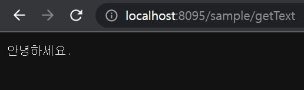

# **Project - REST & Ajax**  ♻️

 ## 💡 `Spring` PROJECT      


---

### 🧾 프로젝트 소개 

---

>**ECLIPSE 환경 구축**

> 1. ECLIPSE 설치
> 2. JDK 설치
> 3. Oracle 설치 
> 4. Tomcat 설치

###### Eclipse Marketplace
> 5. Spring Tools 3 Add-On for Spring Tools 4 [3.9.22.RELEASE] 설치
> 6. Eclipse Enterprise Java and Web Developer Tools 3.20 설치
 
---

#### ◾ **START** 
- 환경설정 및 시작 <br>


---


```

```

