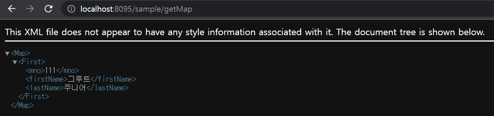
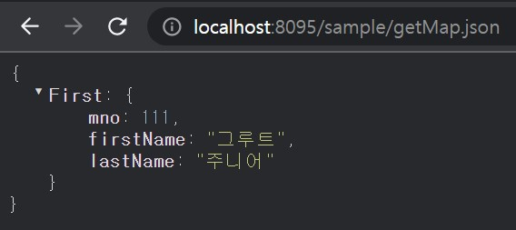
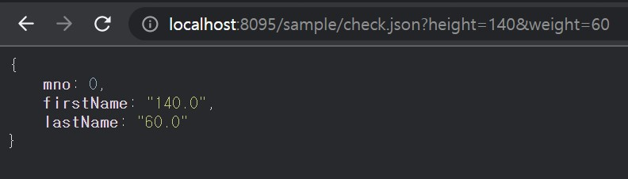
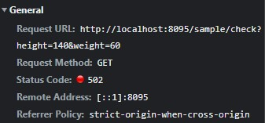
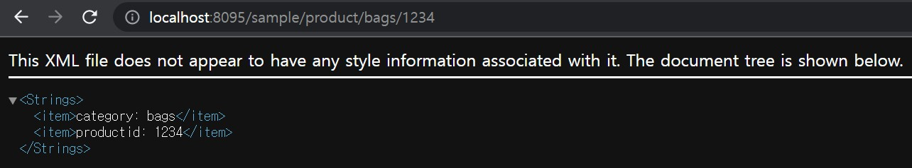
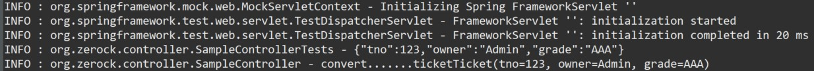
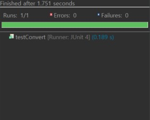

# **Project - REST & Ajax**  ♻️

 ## 💡 `Spring` PROJECT      


---

### 🧾 프로젝트 소개 

---

>**ECLIPSE 환경 구축**

> 1. ECLIPSE 설치
> 2. JDK 설치
> 3. Oracle 설치 
> 4. Tomcat 설치

###### Eclipse Marketplace
> 5. Spring Tools 3 Add-On for Spring Tools 4 [3.9.22.RELEASE] 설치
> 6. Eclipse Enterprise Java and Web Developer Tools 3.20 설치
 
---

#### ◾ **START ▶ @GetMapping** 
- 환경설정 및 시작 - '안녕하세요' 확인<br>

    - 타입 확인<br>
    

<br>

#### ◾ **getSample** 
- 브라우저가 받은 데이터 - XML<br>

    - 타입 확인<br>
    <br>
      

<br>

#### ◾ **getSample.json** 
- 브라우저가 받은 데이터 - JSON<br>

    - 타입 확인<br>
    

<br>

#### ◾ **getList** 
- 브라우저가 받은 데이터 - XML<br>


<br>

#### ◾ **getList.json** 
- 브라우저가 받은 데이터 - JSON<br>


<br>

#### ◾ **getMap** 
- 브라우저가 받은 데이터 - XML<br>


<br>

#### ◾ **getMap.json** 
- 브라우저가 받은 데이터 - JSON<br>


<br>

#### ◾ **check** 
- 파라미터 값 주기<br>
<br>
- General check - Status Code: 502<br>
    - height가 150 미만이면 HTTP상태메시지 전달<br>
<br>

```
파라미터 값을 반드시 전달해 주어야 하고
하나라도 제대로 전달해 주지 않는다면,
'HTTP 상태 400 – 잘못된 요청' 에러 발생
```
     
<br>

#### ◾ **@PathVariable** 
<br>
값을 얻을 때에는 int, double과 같은 기본 타입의 자료형은 사용 불가

<br>

#### ◾ **REST방식의 테스트** 
#### ▶ @RunWith, @WebAppConfiguration, @ContextConfiguration, @Log4j
```
@RunWith(SpringJUnit4ClassRunner.class)

//Test for Controller
@WebAppConfiguration 
@ContextConfiguration({
	"file:src/main/webapp/WEB-INF/spring/root-context.xml",
	"file:src/main/webapp/WEB-INF/spring/appServlet/servlet-context.xml"
	})
@Log4j
```
#### ▶▶ @Before, @Test
- JUnit 기반의 테스트<br>
<br>
JSON 문자열이 Ticket타입의 객체로 변환
(코드 내의 Gson 라이브러리는 Java의 객체를 JSON 문자열로 변환하기 위해 사용)
    - test succes<br>
<br>
JUnit을 이용하는 방식의 테스트 장점은 Tomcat을 구동하지 않고도 컨트롤러를 구동해 볼 수 있다.
```
↘ 크롬 확장 프로그램 (REST 방식 테스트 도구)
Chrome 브라우저 앱스토어(chrome://apps/) -> 'REST client' 검색
curl(https://curl.haxx.se/) -> 리눅스, Mac 전용

```
---


```

```

